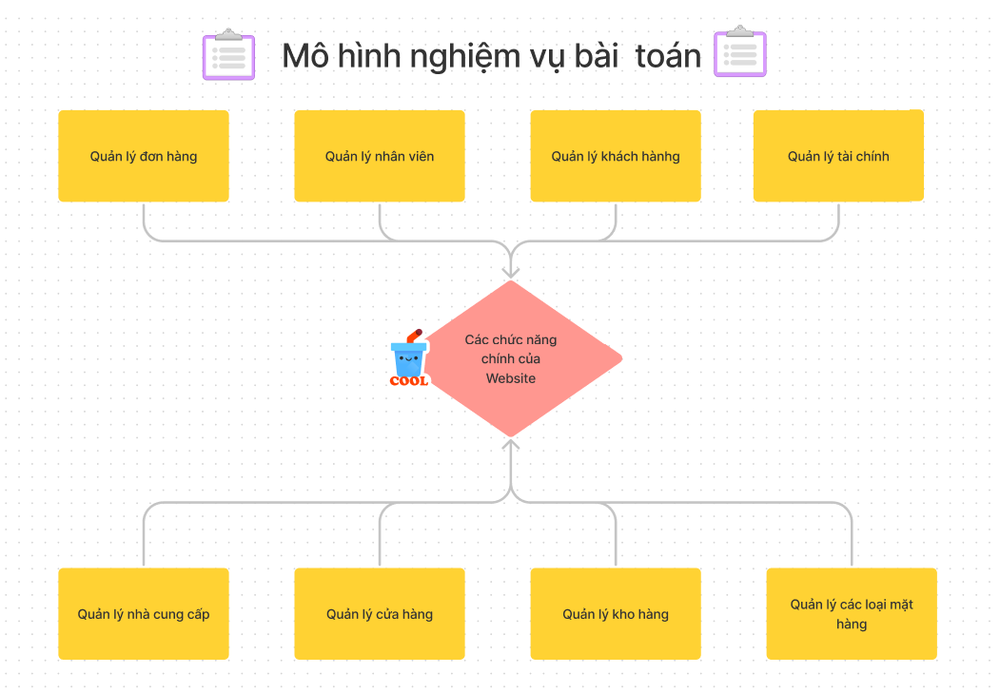

<h3>Nhóm gồm các thành viên là:</h3>
<ul>
    <li>Nguyễn Hoài Nam</li>
    <li>Nguyễn Đức Huy</li>
</ul>

<h1>Đề tài lứa chọn: <strong>Website mua bán đồ uống qua mạng</strong></h1>
<h3>Nội dung:</h3>
<!-- cau 1 -->
<h4>Câu 1: Liệt kê danh sách các vấn đề cần trao đổi với khách hàng để làm rõ yêu cầu. Giải thích ngắn gọn từng vấn đề.</h4>
<ul>
    <li>Chí phí bạn đưa ra để thực hiện website là bao nhiêu.</li>
    <li>thời gian hạn để hoàn thành website là bao lâu.</li>
    <li>Các chức năng chính bạn muốn có trong trang web là những gì.</li>
    <li>Website của bạn hoạt động chủ yếu trên nền tảng nào(pc, mobile).</li>
    <li>Dữ liệu bạn đưa ra là những gì</li>
    <li>Đồ uống của bạn gồm những loại nào. Cấc nhà cung cấp ra sao.</li>
</ul>
<h4>Câu 2: Viết mô hình nghiệp vụ bài toán.</h4>

<h4>Cấu 3: Nêu các điều kiện cần thiết để thực hiện được bài toán, giải thích ngắn gọn về các điều kiện đó.</h4>
<ul>
    <li>Phần cứng: Máy tính cấu hình: Core i7: 2.3 quad-core Intel Core i7, Turbo Boost up to 4.1GHz, with 8MB L3 smartcache (I7-1068NG7)</li>
    <li>Phần mềm: PHP 7.2, MySQL 5.7, Apache 2.4, Jquery 3.3.1, Bootstrap 4.1.1, Font Awesome 5.0.13</li>
    <li>Dữ liệu: Có dữ liệu đồ uống, có dữ liệu khách hàng, có dữ liệu đơn hàng, có dữ liệu đơn đặt hàng, có dữ liệu đơn hàng đã thanh toán, có dữ liệu đơn hàng đã hủy.</li>
    <li>Các thành viên:
        <ol>Lead-1-15tr/tháng</ol>
        <ol>Developer-2-10tr/tháng</ol>
        <ol>Tester-1-10tr/tháng</ol>
        <ol>BA-1-5tr/tháng</ol>
    </li>
</ul>
<h4>Cấu 4: Bạn định dùng mô hình tiến trình nào để phát triển phần mềm công cụ này. Giải thích lý do chọn. nếu dùng tuyến tính thì tuần tự từng bước hết bước nọ đến bước kia dẫn đến nếu cuối cùng mới phát hiện ra sai sẽ phải quay lại từ đầu làm lại.
Nếu dùng nguyên mẫu: tạo nhanh mẫu và làm mịn dần cho đến khi khách hàng đồng ý. Nhược điểm: không biết khi nào lòng tham của khách hàng mới dừng. Phương án đưa ra điều kiện cho khách hàng sửa bản mẫu mâý lần (do dự án) nếu > số lần chỉnh sửa thì tính phí).</h4>
 Lựa chọn mô hình tiến trình:
<ul>
    <li>Tuyến tính: Từng bước hết bước nọ đến bước kia dẫn đến nếu cuối cùng mới phát hiện ra sai sẽ phải quay lại từ đầu làm lại.</li>
    <li>Nguyên mẫu: Tạo nhanh mẫu và làm mịn dần cho đến khi khách hàng đồng ý.</li>
</ul>